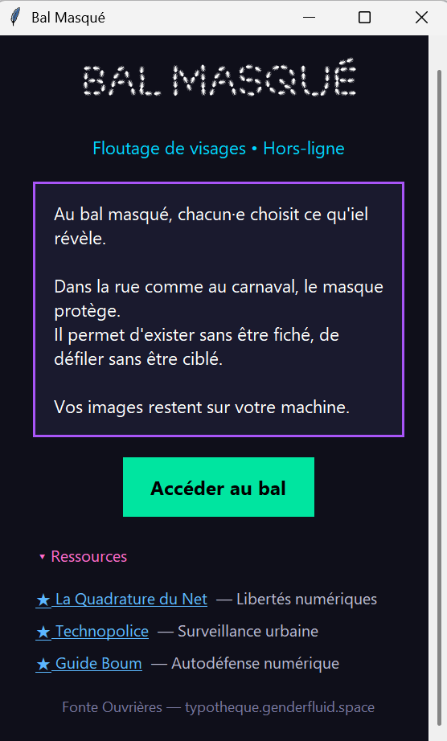
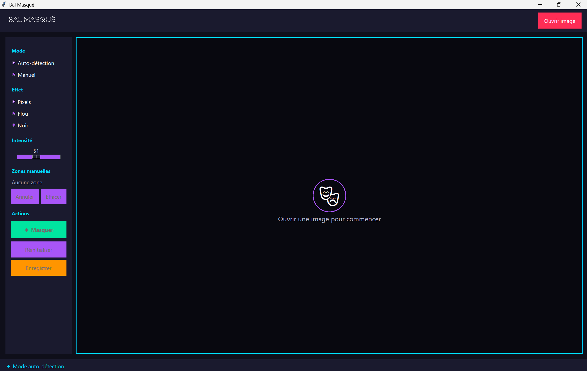

# 🎭 Bal Masqué

**Logiciel libre de floutage de visages et de suppression de métadonnées**


---

## 📖 Description

**Bal Masqué** est un outil de protection de la vie privée permettant de :
- **Flouter automatiquement ou manuellement** les visages sur vos photos
- **Supprimer les métadonnées** sensibles (GPS, EXIF, données d'identification)
- **Analyser la sécurité** de vos images avant partage

100% hors-ligne, 100% open-source, 0% de données envoyées.

---

## ✨ Fonctionnalités

### 🎭 Floutage de visages
- **Détection automatique** des visages (OpenCV Haar Cascades)
- **Mode manuel** pour sélectionner des zones personnalisées
- **3 effets** : Pixelisation, Flou gaussien, Masque noir
- **Intensité réglable** (15-99)

### 🧹 Suppression des métadonnées
- **Données GPS** : coordonnées, altitude, timestamp
- **Données EXIF** : appareil photo, paramètres, logiciels
- **Données d'identification** : numéros de série, identifiants uniques
- **Analyse de sécurité** : rapport détaillé avant/après nettoyage

### 💾 Export
- Formats **PNG/JPEG** haute qualité
- Option de **compression** configurable
- **Prévisualisation** en temps réel

---

## 📥 Installation

### Option 1 : Télécharger l'exécutable (recommandé)

**Aucune installation requise !**

1. Allez dans **[Releases](../../releases)**
2. Téléchargez `BalMasque_v2.0_Windows.zip` (ou Linux/Mac)
3. Décompressez
4. Double-cliquez sur `BalMasque.exe`

### Option 2 : Depuis le code source

```bash
# Cloner le repo
git clone https://github.com/comenottaris/BAL-MASQUE.git
cd BAL-MASQUE

# Installer les dépendances
pip install -r requirements.txt

# Lancer l'application
python bal_masque.py
```

### Option 3 : Builder vous-même

```bash
# Windows
build_exe.bat

# Linux/Mac
chmod +x build.sh
./build.sh
```

---

## 🖥️ Utilisation

### Interface




### Étapes

1. **Ouvrir** une image → `Ctrl+O` ou bouton "Ouvrir"
2. **Analyser** les métadonnées → Onglet "Métadonnées"
3. **Détecter** les visages → `Ctrl+D` ou bouton "Détecter"
4. **Paramétrer** l'effet et l'intensité
5. **Masquer** → Bouton "Appliquer"
6. **Nettoyer** les métadonnées → Bouton "Supprimer métadonnées"
7. **Enregistrer** → `Ctrl+S` ou bouton "Sauvegarder"

### Raccourcis clavier

| Raccourci | Action |
|-----------|--------|
| `Ctrl+O` | Ouvrir une image |
| `Ctrl+S` | Sauvegarder |
| `Ctrl+D` | Détecter les visages |
| `Ctrl+Z` | Annuler |
| `Ctrl+R` | Réinitialiser |

### Mode manuel

- **Dessiner** : Clic gauche + glisser
- **Annuler dernière zone** : `Ctrl+Z`
- **Tout effacer** : Bouton "Effacer zones"

---

## ⚖️ Aspects juridiques

### Droit à l'image

En France (et dans de nombreux pays) :

- ✅ Toute personne a un droit sur son image
- ✅ La publication d'une photo nécessite le consentement des personnes reconnaissables
- ✅ Les personnes peuvent demander le retrait ou le floutage de leur image

**Exceptions** (selon contexte) :

- Événements publics avec foule (manifestations, concerts...)
- Personnalités publiques dans l'exercice de leurs fonctions
- Images accessoires (personne non reconnaissable/non centrale)

### Bon usage

Ce logiciel est conçu pour :

- ✅ Protéger la vie privée des personnes photographiées
- ✅ Respecter le droit à l'image
- ✅ Permettre la diffusion de photos d'événements collectifs
- ✅ Protéger les sources et les personnes vulnérables

Il **ne doit PAS** être utilisé pour :

- ❌ Cacher des informations relevant de l'intérêt public
- ❌ Entraver le travail journalistique légitime
- ❌ Dissimuler des actes répréhensibles

---

## 🛠️ Technologies

- **Python 3.8+**
- **OpenCV** - Détection de visages
- **Pillow** - Manipulation d'images et métadonnées EXIF
- **Tkinter** - Interface graphique
- **NumPy** - Traitement matriciel

---

## 📁 Arborescence du projet

```
BAL-MASQUE/
├── bal_masque.py          # Code principal
├── logo_app.png           # Logo de l'application
├── requirements.txt       # Dépendances Python
├── build_exe.bat          # Script de build Windows
├── build.sh               # Script de build Linux/Mac
├── screenshots/           # Captures d'écran
│   ├── Accueil.png
│   └── retouches.png
├── README.md              # Ce fichier
└── LICENSE                # Licence GPL-3.0
```

---

## 🤝 Contribuer

Les contributions sont bienvenues !

1. **Fork** le projet
2. Créez une branche (`git checkout -b feature/amelioration`)
3. Committez (`git commit -m 'Ajout fonctionnalité X'`)
4. Push (`git push origin feature/amelioration`)
5. Ouvrez une **Pull Request**

### Idées de contributions

- [ ] Support vidéo (floutage frame par frame)
- [ ] Détection de plaques d'immatriculation
- [ ] Mode batch (traiter plusieurs images)
- [ ] Reconnaissance faciale pour exclure certaines personnes
- [ ] Interface en ligne de commande (CLI)
- [ ] Localisation (traductions)

---

## 📝 Licence

**GPL-3.0** - Logiciel libre et open source

Vous êtes libre de :

- ✅ Utiliser ce logiciel à toute fin
- ✅ Étudier et modifier le code
- ✅ Redistribuer des copies
- ✅ Redistribuer des versions modifiées

**Conditions** :

- Le code source doit rester disponible
- Les modifications doivent être documentées
- La même licence doit être appliquée aux dérivés

Voir [LICENSE](LICENSE) pour plus de détails.

---

## 🙏 Crédits & Remerciements

### Projets dont Bal Masqué s'inspire

Ce projet n'aurait pas vu le jour sans le travail remarquable de :

#### 🎭 [BlurryFaces](https://github.com/asmaamirkhan/BlurryFaces) par [@asmaamirkhan](https://github.com/asmaamirkhan)

> Outil de floutage automatique de visages utilisant OpenCV.
> 
> Bal Masqué s'est largement inspiré de l'approche de détection et de floutage de BlurryFaces. Merci à Asmaa pour ce projet élégant et bien documenté qui a servi de base à notre travail sur la détection des visages.
>
> **Licence** : MIT

#### 🧹 [Metadata-Remover](https://github.com/Anish-M-code/Metadata-Remover) par [@Anish-M-code](https://github.com/Anish-M-code)

> Outil de suppression de métadonnées pour protéger la vie privée.
>
> Le module de nettoyage des métadonnées de Bal Masqué s'inspire directement du travail d'Anish sur MRT (Metadata Removal Tool). Son approche claire de la suppression des données EXIF et GPS nous a guidés dans l'implémentation de cette fonctionnalité essentielle.
>
> **Licence** : GPL-3.0

---

### Ressources & Documentation

- **OpenCV** - [opencv.org](https://opencv.org) - Bibliothèque de vision par ordinateur
- **Pillow** - [python-pillow.org](https://python-pillow.org) - Manipulation d'images Python
- **Guide d'autodéfense numérique** - [guide.boum.org](https://guide.boum.org) - Ressources sur la sécurité numérique

### Typographie

- **Fonte Ouvrières** - [typotheque.genderfluid.space](https://typotheque.genderfluid.space) - Police utilisée pour le logo

---

### Organisations qui défendent nos libertés numériques

Un immense merci aux organisations qui luttent quotidiennement pour nos droits :

| Organisation | Description | Lien |
|--------------|-------------|------|
| **La Quadrature du Net** | Défense des libertés fondamentales dans l'environnement numérique | [laquadrature.net](https://www.laquadrature.net) |
| **Technopolice** | Observatoire des technologies policières | [technopolice.fr](https://technopolice.fr) |
| **BOUM** | Guide d'autodéfense numérique | [boum.org](https://boum.org) |
| **Exodus Privacy** | Analyse des trackers dans les applications | [exodus-privacy.eu.org](https://exodus-privacy.eu.org) |
| **Framasoft** | Éducation populaire et logiciels libres | [framasoft.org](https://framasoft.org) |
| **Nothing2Hide** | Protection des journalistes et activistes | [nothing2hide.org](https://nothing2hide.org) |
| **EFF** | Electronic Frontier Foundation | [eff.org](https://www.eff.org) |

---

## 📬 Contact & Support

- **Issues** : [Signaler un bug](../../issues)
- **Discussions** : [Forum](../../discussions)
- **Email** : siratton@pm.me

---

## 💡 Pourquoi ce projet ?

Dans un contexte de surveillance généralisée, de reconnaissance faciale déployée sans consentement, et de collecte massive de données personnelles, il est essentiel de disposer d'outils simples pour protéger notre vie privée et celle des autres.

**Bal Masqué** est né de ce besoin : permettre à chacun·e de partager des photos sans compromettre la sécurité des personnes qui y apparaissent.

> *"La vie privée n'est pas une question de 'si on n'a rien à cacher'. C'est une question de pouvoir choisir ce qu'on montre et à qui."*

---

<div align="center">

**Protégez la vie privée. Respectez le droit à l'image. Utilisez des logiciels libres.**

🎭

*Fait avec ❤️ et du code libre*

</div>
